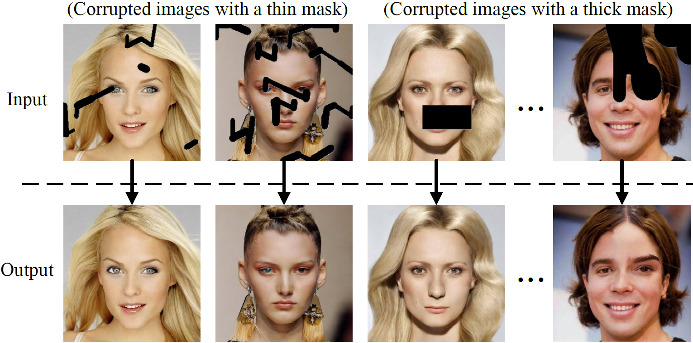
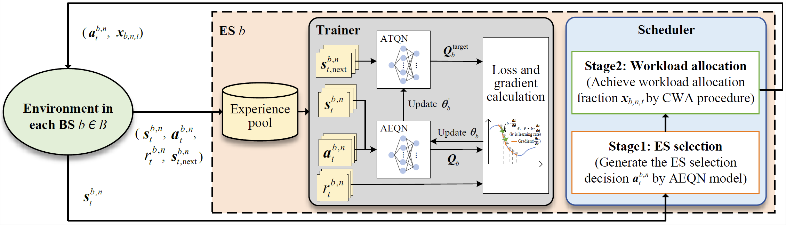
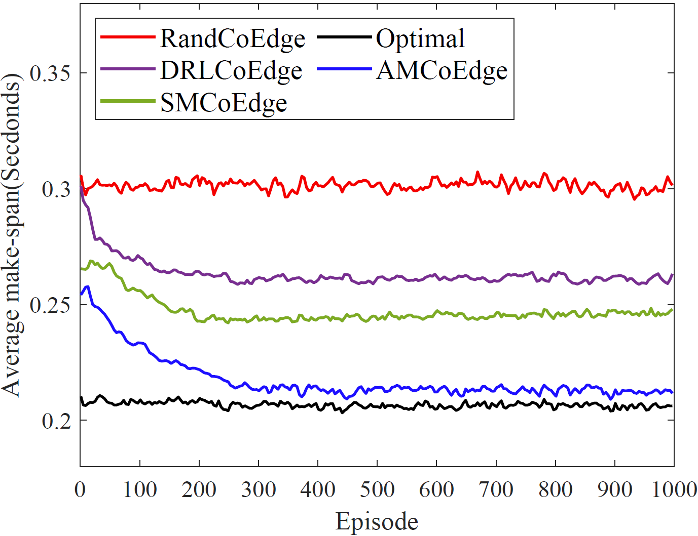

# AMCoEdge Implementation
This repo is an implementation of our papers "**Enhancing AI-Generated Content Efficiency through Adaptive Multi-Edge Collaboration (published in ICDCS 2024)**" 
and "**A Distributed System for Enhancing AIGC Service Efficiency with Adaptive Multi-Edge Collaboration (submitted to IEEE TPDS)**". 
We propose AMCoEdge, an adaptive multi-server collaborative MEC approach tailored for heterogeneous edge environments to optimize AIGC service efficiency. 
In this repo, we implement the proposed AMCoEdge method, Baselines, and Stable Diffusion (SD) model [1] deployment in our papers.

### Illustration results of image-repairing by AMCoEdge and prototype system.
<div align=center>

</div>
We develop a distributed edge computing prototype system with five Jetsons consisting of three AGX Orin devices and two Xavier NX devices. 
AMCoEdge is implemented on the prototype system deployed with a SD1.5  model. 
We select the image-repairing task of AIGC services as a representative example in our experiments.


## I. AMCoEdge Method
We propose a novel AMCoEdge method that dynamically allocates computing and networking resources across all ESs through parallel multi-ES selection and online workload distribution, thereby minimizing the offloading make-span of AIGC services.

### AMCoEdge Framework
<div align=center>

</div>
 When a task arrives at the BS, the scheduler first generates the ES selection decision by AEQN model, and then achieves the task workload allocation fraction by CWA procedure.

### Convergence Analysis 
<div align=center>

</div>
Our AMCoEdge method achieves the lowest average make-span, outperforming the RandCoEdge, DRLCoEdge [2], and SMCoEdge [3] methods by about 28%, 17%, and 12%, respectively, 
and closely approximates the heuristic optimal method's (Optimal) result.

### Code implementation
The function of our AMCoEdge method mainly two stages:
1) Make the ES selection decision by the proposed adaptive DQN model in the first stage.
2) Make the workload allocation decision by the proposed Closed-form Workload Allocation (CWA) or High Effient CWA (HECWA) algorithm in the second stage. The user can set to use the CWA or HECWA algorithm in the main.py file. 

To run this code, please install packages: tensorflow 1.4.0., NumPy, and matplotlib.

The code of our AMCoEdge method mainly consists of three files: `AdaDQN.py`, `environment.py`, and `main.py`.

1) The main.py file is the main code. User should run this code to achieve the experimental results.
2) The environment.py includes the code for MEC environment. In this file, some environment parameters such as ESs' computing capacities, task size, and transmission rate can be ajusted by user.
3) The AdaDQN.py includes the code for Adaptive deep reinforcement learning model. 

### Test Usage
User can run the `main.py` to achieve the corresponding experimental results.
```sh
python3 main.py
```
### Paramters setting
All the parameters in current codes are set by default. 
Hence, user can just the parameters such as task deadline, task arrival probability, computing capacity, and the number of tasks, 
and then run the main.py to get more experimental results.

Parameters setting information: 
1) Deadline. User can adjust the variable value of DEADLINE in main.py. For example, the DEADLINE can be set from 0.1 to 1.0 seconds and then run main.py to achieve the corresponding experimental results.
2) Task arrival probability. User can adjust the variable value (i.e., from 0.1 to 1) of TASK_ARRIVAL_PROB in main.py, thus runing main.py to achieve the corresponding experimental results.
3) The number of tasks. User can adjust the variable value (i.e., from 10 to 100) of NUM_TASK in main.py, thus runing main.py to achieve the corresponding experimental results.
4) The ESs' computing capacities. If user want to achieve the results varying different ESs' computing capacity's, user can adjust the variable value of BS_capacities in main.py and then run the main.py to achieve the corresponding experimental results.


## II. Baselines Implementation
We implement four baselines (i.e., RandCoEdge, DRLCoEdge, SMCoEdge, and Optimal) in our experiments. 

The specific code of baselines is stored in the Baseline folder. Here, the RandCoEdge and Optimal baselines are implemented based on the code of AMCoEdge method. 
The DRLCoEdge and SMCoEdge baselines are implemented based on the existing methods in [2] and [3], respectively. 
Note that for fairness, the workload allocation decisions of all methods are satisfied with the same constraints in the experiment. 
For example, we add the CWA algorithm into the DRLCoEdge method. Some environment parameters in the codes of baselines are set with the same of our AMCoEdge method.


## III. Image-repairing with SD1.5 Model
The source code of the original SD1.5 model is released on the GitHub [sd1.5 model](https://github.com/bubbliiiing/stable-diffusion). 
Here, we implement an image-repairing task as a representative example for AIGC services by using the SD1.5 model. 
The specific code of image-repairing function is stored in the `image_repair` folder that has a `repair.py` file and other files. 
The repair.py is used as a demo for image-repairing task in this repo.
User can run this code to generate a repaired image.

### Test Usage
User can run the `repair.py` to repair a corrupted image.
```sh
python3 repair.py
```
Images will be output to `output.png` by default

### Install
To run this code, please install key packages according to the original [sd1.5 model](https://github.com/bubbliiiing/stable-diffusion).


# References
[1] J. Ho, A. Jain, and P. Abbeel, “Denoising diffusion probabilistic models,” Advances in neural information processing systems, 2020.

[2] M. Li, J. Gao, L. Zhao, and X. Shen, “Deep reinforcement learning for collaborative edge computing in vehicular networks,” IEEE Transactions on Cognitive Communications and Networking, 2020.

[3] C. Xu, Y. Li, X. Chu, H. Zou, W. Jia, and T. Wang, “Smcoedge: Simultaneous multi-server offloading for collaborative mobile edge computing,” in ICA3PP 2023. (An extended Version has been published on IEE TMC) [Code](https://github.com/ChangfuXu/SMCoEdge)

# Citation
If our method can be used in your paper, please help cite:

@inproceedings{xu2024enhancing, title={Enhancing AI-Generated Content Efficiency through Adaptive Multi-Edge Collaboration}, author={Xu, Changfu and Guo, Jianxiong and Zeng, Jiandian and Meng, Shengguang and Chu, Xiaowen and Cao, Jiannong and Wang, Tian}, booktitle={204 IEEE 44th International Conference on Distributed Computing Systems (ICDCS)}, pages={960-970}, year={2024}, publisher={IEEE}}